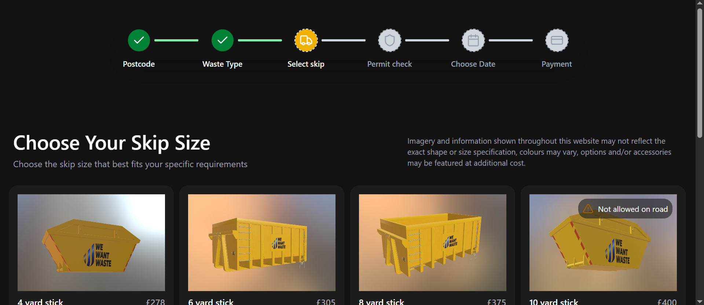
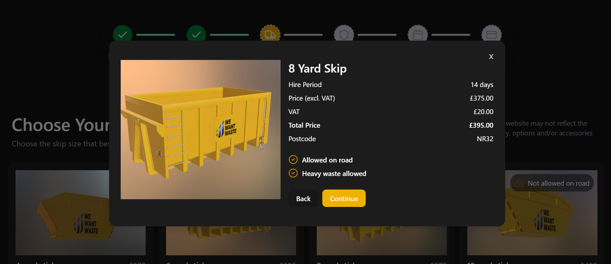

# WeWantWaste Skip Selection Page Redesign

## Overview

This is a complete redesign of the "Choose Your Skip Size" page from [WeWantWaste](https://wewantwaste.co.uk/), created as part of a front-end challenge. The goal was to modernize the UI/UX while keeping the original functionality intact, making the page more intuitive and responsive across all devices.

---

## What I Improved

### Progress Step Bar

- Redesigned the progress indicator for better clarity.
- Added checkmark icons to completed steps so users always know where they are in the flow.
- Initialization begins at step index `2` to match the redesign scope.

### Page Header

- Refactored using `Flexbox` to align important step related information clearly.
- Moved the previously hidden disclaimer to a more visible position at the top of the page for better UX.

### Skip Size Cards

- Each card clearly displays:
  - **Product image**
  - **Number of yards**
  - **Price**
  - **Select button**
- On clicking **Select**, a modal popup opens containing:
  - Detailed information about the selected skip
  - Taxes, pricing breakdown, road permissions, and more.

The entire redesign is fully responsive. Optimized layout and components for both mobile and desktop views.

---





- [ ] **Redesigned Progress Bar**
- [ ] **Visible Disclaimer**
- [ ] **Responsive Skip Cards**
- [ ] **Skip Details Modal**

---

## Tech Stack

- React
- Vite
- TypeScript
- shadcn/ui
- Axios

---

## 🧪 How to Run Locally

1. **Clone the repository:**

```bash
git clone https://github.com/eofoneta/remwaste-challenge.git
cd remwaste-challenge
```

2. **Install Dependencies**
```bash
npm install
```

3. **Run Development server**
```bash
npm install
```
4. Open http://localhost:5173 in your browser to view the site.